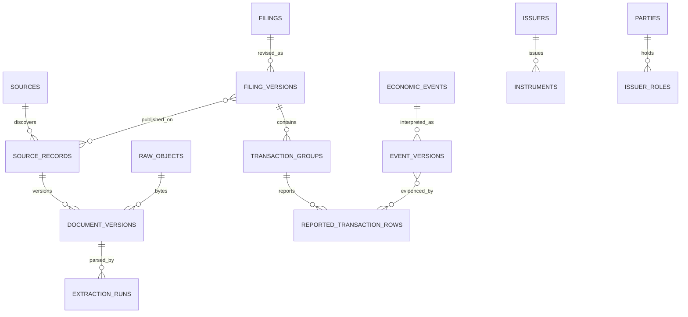

# Data Model

`migrations/001_initial.sql` is executable truth. Migrations are numbered and checksummed in `schema_migrations`. Internal text IDs are immutable hashes over source-scoped evidence keys. Foreign keys are enabled on every connection; writes use short `BEGIN IMMEDIATE` transactions, WAL, `synchronous=FULL`, and a 5-second busy timeout.

Filing and event facts are versioned. Current pointers do not erase prior versions. Source records can have multiple immutable document hashes. Filing versions retain the issuer name printed in that publication and transaction groups retain their printed instrument name; shared LEI/ISIN entities must not overwrite those event-specific labels. An option's reported underlying-share ISIN is stored separately from the option's own identifier. Detailed rows and reported aggregates coexist; if genuine details exist they alone receive `selected_for_analytics=1`.

Financial values are canonical decimal TEXT. Python `Decimal` performs multiplication, comparison, totals and numeric sorting before pagination. Raw strings, quote-unit scale, normalized unit price, reported consideration, derived consideration and formula remain separate. Missing values are null plus provenance/quality status, never zero.

Known timestamps retain ISO offsets or UTC `Z`; date-only values use `YYYY-MM-DD`. Publication, retrieval, extraction and acceptance are separate columns. Strict as-known-at reconstruction uses append-only filing/event versions and their acceptance times; source-historical and platform-observed views must be labelled in future analytics.
